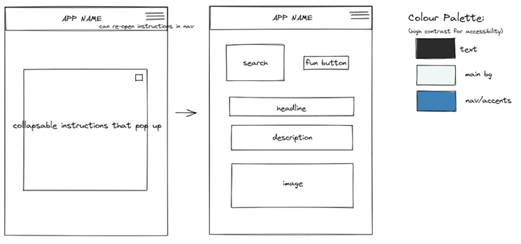
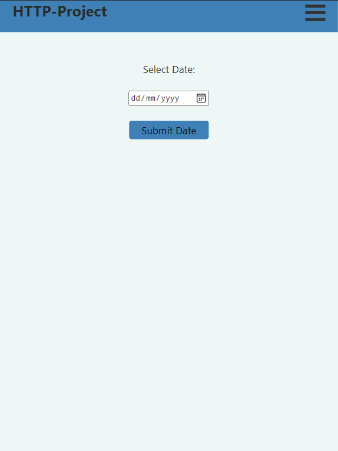
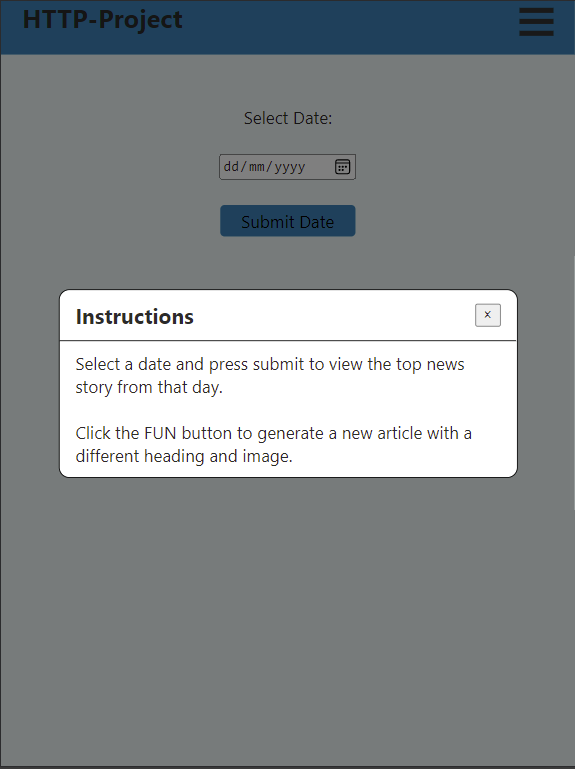
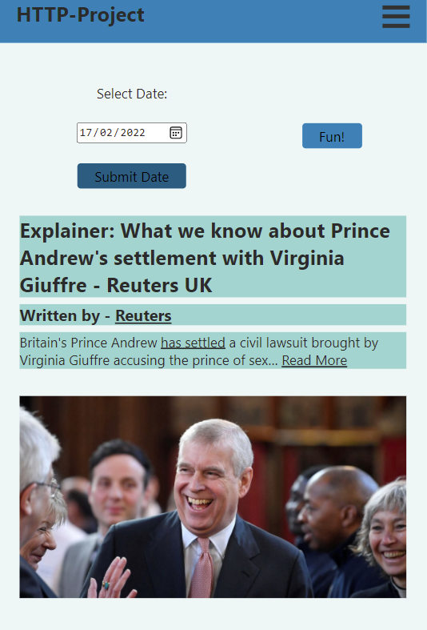
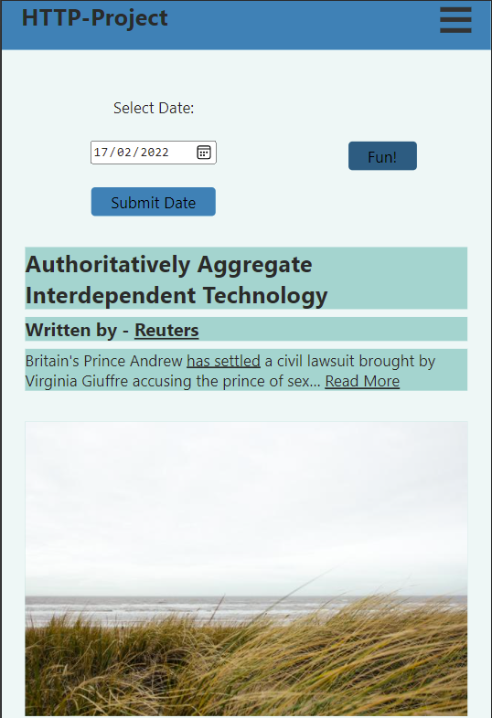

# HTTP-project

Http project for Founders and Coders

---

**Disclaimer: As the NewsAPI only supports cors from localhost, to view this site clone and then view from your own localhost.**

---

## What we're building

A news site with an ability to search for a random article by date.  
The ability to add some fun to articles by changing the image and headline of an article.

---

## Which APIs are utilised

- [NewsAPI](https://newsapi.org/#documentation) A collection of past news headlines
- [Corporate Buzzword](https://github.com/sameerkumar18/corporate-bs-generator-api) A random buzzword generator
- [picsum](https://picsum.photos/) A random Image Generator

---

## User Journey <!-- INPUT SCREENSHOTS -->
- Can view instructions based on 
- Input any date in the past, (Min date still to be found) 
- Recieve a news article layed out in a traditional format 
- Can click a button of ***'fun'*** to change headline and image 
- Can click  ***'fun'*** button again to get different or submit first form again to get new article

     

   

---

## User Stories

### Main Stories

- See news article from date inputted
- mashed up with random headline and images after button clicked
- View the app on all of my devices
- Site is accessible to all

### Stretch Stories

- Loading bar while data is fetched and loaded
- Error handler with visual feedback when encountering an error
- Add significant dates buttons for some interesting articles
- Pop up for the instructions (like wordle)

---
